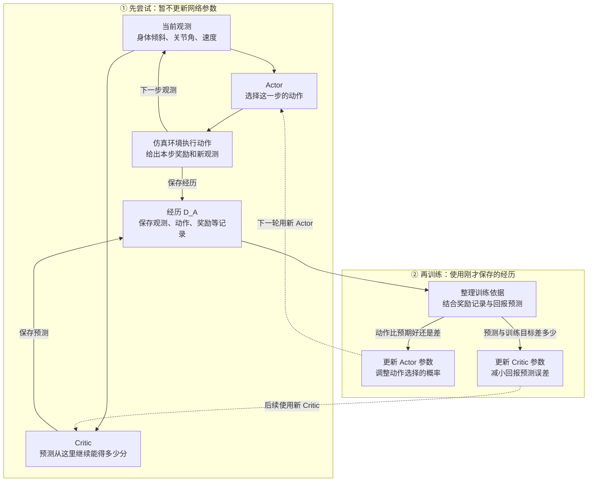

# 教学第一课：先看完整训练流程

记录日期：2026-10-01。阶段：Lesson 01 Pipeline。状态：流程图与绘图 prompt 已准备；学员理解待确认。

## 目标与教学调整

用户明确反馈上一段听不懂，希望先看 pipeline，或获得可交给其他绘图 Agent 的 prompt。暂停一步 TD、折扣与终止条件的追问，先把“尝试收集数据”和“用数据训练”分开。

本图只解释仿真站稳任务中的数据流、Actor/Critic 分工与参数更新位置，不展开公式。用户已答对固定 Actor 的两项判断，这些证据保留；不能据此推断已理解回报估计。没有运行新训练或仿真。

## 流程图

读图顺序：先看上半部分怎样产生经历 D_A，再看下半部分怎样改变两个网络。实线是信息流，虚线表示训练完成后进入下一轮使用。



图中的“多少分”指按任务定义的后续累计回报，未展开折扣。“整理训练依据”是实际计算步骤，不是第三个神秘网络，也没有人工标注的正确动作。

## 怎样读这张图

1. 先让 Actor 在仿真中尝试，环境按照我们设定的奖励规则提供每步反馈；Critic 同时作回报预测。多步记录组成 D_A。Critic 不负责制造环境奖励。
2. 收集完一批后，用这些保存的记录计算损失并更新参数。Actor 学习怎样选择动作，Critic 学习怎样预测回报；同一批数据可以在这一步训练若干遍，历史经历不会被改写。
3. 更新后的网络再参与下一轮数据采集。是否站得更稳，需要新执行与评测；不能只看 Critic 损失下降。

观测节点是简化表达，不要求两个网络必须使用完全相同的信息；某些机器人训练会为 Critic 提供额外仿真信息。图中省略旧动作对数概率、下一观测与结束标记等字段，实际 PPO 数据仍需包含所需信息。动作到控制器/力矩的细节也暂不展开。

本次不继续讲一步 TD 的数字，不要求学员当场答新数值题。先根据学员指出的某个框或箭头解释一条数据怎样流过去。

## 可复制给绘图 Agent 的 prompt

```text
请为懂一点视觉监督训练、刚接触强化学习的研究生，画一张中文的 PPO 训练入门流程图。场景是“仿真机器人练习站稳”，重点是看清数据流与两个网络的分工，不要画成论文式复杂架构图。不要放数学公式或引入 TD、GAE、KL 等新术语。

采用从上到下的两个区域。标签清晰，节点文字简短，箭头避免交叉。

上区标题：“① 先尝试：暂不更新网络参数”。
- “当前观测：身体倾斜、关节角、速度”分别指向 Actor 和 Critic。
- Actor 节点写“选择这一步的动作”，箭头指向“仿真环境执行动作”。
- 环境按照预先设定的规则产生“本步奖励和新观测”；新观测回到观测节点，表示继续下一步。
- Critic 节点写“预测从这里继续能获得的累计分数”，不要把预测画成真实奖励，也不要画 Critic 直接控制关节。
- 多步交互保存到“经历 D_A：观测、动作、奖励等记录”；Critic 的预测也保存进记录。图注说明实际 PPO 还需旧动作概率、下一观测、结束信息等，主图不用挤满全部字段。

下区标题：“② 再训练：使用刚才保存的经历”。
- D_A 指向“整理训练依据：结合奖励记录与回报预测”。这是计算过程，不是第三个网络。
- 从这里分成两支：“动作比预期好还是差”指向“更新 Actor 参数：调整动作选择的概率”；“预测与训练目标差多少”指向“更新 Critic 参数：减小回报预测误差”。
- 两支分别用虚线回到上区的 Actor 和 Critic，标注“下一轮使用更新后的网络”。

关键边界：采集与参数更新是两个阶段；奖励来自环境规则，Critic 提供预测；D_A 是尝试记录，不是正确动作标签；训练不改变已经发生的经历；Critic 损失下降不能单独证明机器人表现提高。观测在主图合并表示，不暗示 Actor 和 Critic 一定使用完全相同的信息。

用默认主题或克制配色区分区域，用明确标签而非只靠颜色表达含义。交付可编辑流程图；若支持 Mermaid，请同时提供 Mermaid 源码。不要额外画新算法、机器人硬件接线或整套衣服/SMPL 遥操链路。
```

## 版本、验证与保存

- 主项目：`hp3090:/media/yu/FAFF-E9771/YUANQI`；本地镜像：`/Users/yu/Documents/ChatGPT/元启`。
- 编辑基线：`a5e6ac8cd8cf3d0c9fc7dc0cecc96e977cd0d236`；核验时服务器工作区干净，GitHub main 一致，本地恢复文件哈希匹配。
- 本次只新增本 README，并更新复习记录、报告索引和当前状态。没有新增可执行训练代码；没有启动训练、下载模型或操作真机。
- 图的交付形式为 Mermaid；人工检查数据来源、箭头语义、两个更新分支、Markdown 链接和差异，运行项目载荷审计。没有独立浏览器渲染验证；实际显示由聊天和 Markdown 阅读器完成。
- 基线与执行日志：`logs/lesson01_pipeline_base_20261001.json`、`logs/lesson01_pipeline_publish_20261001.log`。GitHub 同步结果以发布日志与 Git 历史为准，不在推送前认定成功。

```bash
ssh hp3090
cd /media/yu/FAFF-E9771/YUANQI
git status --short --branch
git log -3 --oneline
git ls-remote origin refs/heads/main
cat logs/lesson01_pipeline_publish_20261001.log
```

## 下一步与恢复入口

当前教学停在流程图层面，等待学员指出不清楚的框或连线；优先沿一条具体经历说明，不自动恢复 TD/终止问题。原题没有回答，不算答错，更不能记成已掌握。工程训练主线与未验证项见[当前状态](README_CURRENT_STATE.md)，P0 仍未通过。
