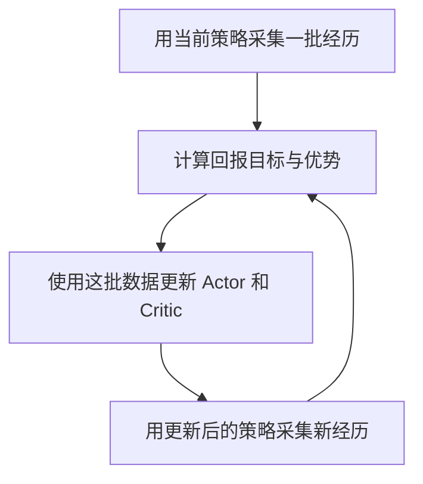

# 第一课 · 第八小节：把一次更新放回 PPO 训练循环

记录日期：2026-10-01。阶段：L01-S08。状态：学员已答对动作记录代表当时的尝试；最新补充初始策略、数据来源、人指定的任务/动作接口及同批训练的解释，理解待确认；未运行新的训练实验。

## 目标与范围

用户在研究简报后要求继续学习。承接第七小节的真实代码演示，先回顾“损失 → 梯度 → 参数更新”，再只增加采集经历与同批训练两个环节，不同时展开 GAE、并行环境或连续动作分布。

本轮只维护教学与恢复记录。既有 Actor/Critic 数值来自第七小节的 CPU 固定样本演示，不是本轮新增测量，也不是机器人训练结果。

## 阶段回顾：同一条经历有两种用途

沿用完整回合、不打折的教学例子：初始观测描述关节角、速度和机身姿态；Actor 在这个观测下采样动作 0，采集时概率 50%；Critic 预测从这里继续行动的回报为 10。随后获得奖励 4、5、5，初始时刻的实际累计回报为 14，简化优势为 +4。14 是初始时刻的回报，不能给这段经历中所有时刻都贴上同一个回报标签。

- Actor：用 +4 这个评分训练动作分布；第七小节的简化网络在一次 SGD 更新后，动作 0 概率由 50% 变成约 59.87%。这是同一输入下的概率变化，不是关节角度增加。
- Critic：用回报目标 14 训练预测；基础平方损失对示例唯一权重的梯度为 −8，一次更新后预测从 10 变成 10.8。长期学习的是当前策略的平均回报，不能永远固定为 14。
- `backward()` 计算并保存梯度；`optimizer.step()` 才修改网络参数。两个网络的训练目标不同，都服务于改善策略表现。

数字与执行证据见[第七小节](README_LESSON01_ACTOR_CRITIC_UPDATE_20260930.md)，本轮没有重跑已有验证。

## 本节新内容：采集与更新分开看

以下讲常见的同步 PPO 流程，不声称所有机器人系统都采用相同执行调度。



### 采集阶段

策略根据观测给出动作分布，采样动作，让仿真环境执行，保存经历。在这一段采集中，策略参数通常保持固定。机器人一直在动、观测和动作一直变化，不等于每个控制步都在更新网络参数。

除观测、动作和奖励，还需保存训练所需的采集信息，例如旧动作概率/对数概率、价值预测和结束标记；字段细节留到后续真实采样代码再讲。

收集一批经历常称为 rollout。一批经历可以来自多个环境、多个回合片段；本节用完整回合简化回报计算，并不要求实际 PPO 等每个回合彻底结束。

### 更新阶段

拿已保存的经历计算损失、反向传播，再执行优化器更新。同一批经历可以分成小批次并训练若干遍；一遍通常称为一个 epoch。本节先理解“同一批数据可以用几遍”，不同时展开小批次划分。

训练五遍数据，不表示仿真器要把当时那段动作重新执行五遍。通常是在对保存的数值做网络计算。更新阶段也不需要每执行一次 `step()` 就立刻让机器人试一个动作。

同批训练时，采集时存下的旧概率保持不变，当前策略对已保存观测/动作的概率会随参数改变。此前已讲过 PPO 裁剪及同批分母，本节只连接其用途，不重复原数值考题。

### 再次采集

有限次数更新后，用更新后的策略重新与环境交互，采集新经历。策略改变后，动作分布、可能遇到的状态及取得的回报都会改变。永远重复第一批数据不能测出新行为的后果，也不能保证旧数据始终适合当前 PPO 更新。

结构示意，不是可直接运行的训练脚本：

```text
重复若干轮：
    用当前策略采集一批经历
    根据这批经历计算回报目标和优势
    对这批数据训练若干遍：
        计算 Actor / Critic 损失
        清除旧梯度，backward()，optimizer.step()
    进入下一轮，用新策略采集
```

本节阶段总结：采集让我们看到行为结果，更新让网络利用这些结果，再采集让我们检验新策略并获得新的学习依据。

## 10/1 跟进：从视觉监督学习理解“经历”

用户已有视觉训练经验，将其概括为“一批图 → 训练 → 得到参数 → 验证 → 重复若干 epoch”。最新提问希望具体理解经历及其与监督学习数据集的关系。此时暂停推进新算法，先补齐数据与学习目标的对应关系。

### 视觉训练流程需要补准的两点

以常见图像分类为例，固定训练集包含图像和类别标签。每取一个小批次，就可以计算损失、反向传播并更新参数；完整遍历训练集一遍通常叫一个 epoch。参数在批次更新过程中持续变化，不是到 epoch 结束才第一次得到参数。

验证是在单独的验证集上测量当前模型表现，通常不反向传播或用验证样本更新参数。验证频率可按 epoch 或若干次更新设置，不要求每个训练批次之后都验证。验证可以影响模型选择与后续配置，但不是另一遍训练。

### 一条经历就是具体保存的数据

在线 PPO 当前采集的一批经历，可暂时理解为这一轮使用的临时训练数据集。一条基本记录保存“当时看到什么、采取了什么动作、获得什么奖励、之后看到了什么、回合是否结束”。下面只是教学数值，观测只列两个量，动作沿用之前两个离散选项中的动作 0；并非机器人实际观测或动作定义。

```python
experience = {
    "obs": [5.0, 2.0],       # 前倾角 5 度、角速度 2 度/秒
    "action": 0,             # 当时策略选择了动作 0
    "reward": 4.0,           # 环境根据奖励规则给出这一步的分数
    "next_obs": [4.0, -1.0], # 执行动作后的观测
    "done": False,           # 这一回合还没结束
}
```

实际代码常把许多记录组成张量并存在内存中，不一定写成磁盘文件。PPO 还会保存采集时的动作概率/对数概率与价值估计等信息；不同实现可用相邻观测等方式组织下一状态，不一定逐条保存上面的字典。真实实现还需正确区分任务终止和时间截断，本节先不展开。

沿用完整回合、无折扣的例子，随后两步的奖励为 5、5，第一步的回报才是 4+5+5=14。单步奖励 4 与累计回报 14 是两种量。这批数据是按时间关联的行为结果；它不只是一组输入图片和标准动作答案。

### 动作记录不是“正确动作标签”

图像分类中的 `label=猫` 表示希望模型预测“猫”。经历中的 `action=0` 仅表示策略当时尝试了动作 0，并不证明这个动作正确。环境通常不会提供“这个状态的最优动作是什么”的标准标签，而是按奖励函数给出尝试的后果；奖励函数需要我们设计，不等于系统自己知道真实任务目标。

在之前的简化例子中，第一步回报目标为 14、采集时 Critic 预测为 10，优势为 +4。Actor 用这个评分调整动作概率；若同一预测下回报为 6，优势为 −4，示例未裁剪区域的更新方向相反。不能无条件把经历里出现过的动作当正确答案去模仿，也不能仅凭一次成败证明哪个动作最优。

Critic 的观测到回报目标拟合，确实类似监督回归；强化学习训练中可以包含这种监督式子问题。Actor 与 Critic 都可用损失、反向传播和优化器。两类学习不靠“有没有标签形式的数字”“有没有 epoch”区分，重点在任务目标、反馈来源及策略与后续数据的关系。

| 对照项 | 常见固定数据集图像分类 | 当前学习的在线 PPO |
| --- | --- | --- |
| 数据来自哪里 | 预先准备的图像与类别标签 | 当前策略与环境交互产生的记录 |
| 希望学到什么 | 给输入预测正确类别 | 选择能提高未来累计奖励的动作 |
| 输入之外的训练依据 | 提供的类别标签 | 尝试的动作、奖励与后续结果，再构造回报/优势等目标 |
| 更新怎样进行 | 对小批次计算损失、反向传播、更新参数 | 对采集数据的小批次计算损失、反向传播、更新参数 |
| epoch 遍历什么 | 当前训练数据集 | 本轮刚采集的数据；有限次更新后再采集 |
| 如何验证 | 验证集预测指标，通常不更新权重 | 用策略单独执行评测回合，测任务表现，评测数据不拿来更新 |

流程对应：

```text
固定图像分类数据 D：
    D 上训练第 1 遍 → 第 2 遍 → 第 3 遍……
    按计划穿插验证，网络参数持续更新

在线 PPO：
    策略 A 与环境交互 → 数据 D_A → 在 D_A 上训练若干遍 → 策略 B
    策略 B 与环境交互 → 数据 D_B → 在 D_B 上训练若干遍 → 策略 C
    按计划单独评测，评测本身不更新策略
```

此处“数据会重新采集”描述的是常见在线 PPO，不是所有强化学习的定义；离线强化学习也可使用固定数据集，暂不展开。因此更根本的区别是学习行动后果和累计奖励目标，不能只按数据集是否固定区分。

## 10/1 再跟进：第一批数据从哪里来，具体训练什么

用户正确回答 `action=0` 表示当时尝试了动作 0。随后连问：是否需要原始数据集、策略 A 从哪里来、任务/动作由谁指定、D_A 是否是按时间记录机器人与环境变化的数据，以及在 D_A 上训练是否更新 Actor/Critic。本次用“仿真机器人原地站稳”串联这些问题；属于同一理解卡点的深化，不据此开始新算法或训练作业。

### 数据集、参考动作与环境资源分别是什么

在线 PPO 需要训练数据，但通常不要求事先准备一套人工标好正确动作的样本集。它可以先创建策略，再通过与环境交互产生第一批训练经历。一个站立任务可以不使用专家动作示范，但仍需可交互环境、机器人结构/物理模型、观测和动作定义、奖励规则、初始状态与结束/重置规则。

这不意味着本项目以后完全不需要动作数据。我们最终做衣服/SMPL 动作跟踪时，通常要准备与机器人任务适配的参考动作，或在部署时接收实时参考；这些参考用于说明“希望机器人跟踪什么”，并可参与观测和跟踪奖励。D_A 则记录策略在仿真里实际怎样执行、结果如何。参考轨迹与策略经历用途不同，SMPL 人体轨迹也不能不经适配就当作机器人关节指令。

### 策略 A 就是初始 Actor 的动作选择规则

网络结构、输入输出和初始化方法由我们选择。第一次运行时，权重通常按初始化规则产生，常含随机初始化，因而策略尚未学会站稳；也可以从已有策略权重继续训练，但不是必需条件。

未训练的分类网络也能输出类别概率，只是通常不准确。初始 Actor 同样能根据观测输出动作分布，再从中采样动作。第一批经历就是这样获得的，并不要求先存在一个合格专家。Critic 也被初始化；上一节特意设置预测 10 是便于手算，不是 PPO 的固定初值。

“初始时确定”只表示第一次行动前参数有具体值；在常见同步 PPO 的这一批采集期间保持它们固定，后面的训练会改变参数。动作采样本身仍可以有随机性。网络架构、权重与一段固定动作序列不能混为一谈。

### 人指定任务和动作接口，Actor 产生每一步的具体动作

以站立教学任务为例：

| 人在配置中规定 | 例子 |
| --- | --- |
| 任务与初始条件 | 从设定的初始姿态开始，保持身体直立 |
| 观测内容 | 关节角度/速度、机身姿态和角速度等 |
| 动作的含义与范围 | 每个可控关节的目标角偏移，限定缩放和范围 |
| 反馈与重置规则 | 根据直立、稳定等表现计算奖励；跌倒后终止/重置 |

上一节动作 0 是简化的离散示例。实际人形策略常输出连续向量；例如动作向量表示各关节相对默认姿势的目标角偏移，经过缩放得到关节目标，再由 PD 控制器产生力矩。关节目标偏移只是常见接口，不是 PPO 强制要求，其他系统也可定义力矩等动作。

我们规定向量每个分量代表什么；Actor 决定当前这一步输出哪些数值。任务“站稳”、动作接口“输出关节目标偏移”、某一步具体输出的偏移向量，是三个层次。若做动作跟踪，参考姿态/目标也可随时间变化并作为策略输入，不等于人逐步标注最优底层控制动作。

仿真器根据机器人状态、控制作用、重力与接触等计算下一状态，任务代码计算奖励。初始策略可能很快跌倒，仍能留下有效经历；不能把所有失败经历从训练中删除，也不能据此保证任意奖励和初始化都能训练成功。

### D_A 是什么

用户提出的“按时间记录机器人关节及环境变化的一组数据”方向基本正确，还必须补上采取的动作和得到的奖励等学习依据。典型内容是观测、动作、奖励、下一观测和终止/截断信息，以及 PPO 需要的采集时动作概率、价值预测等。

时间顺序可以用步索引、固定步长和环境编号表达，并不一定逐条保存显式时间戳。环境信息保留训练所需部分；机器人结构模型由仿真器加载，不必在每条记录里重新保存。多环境数据要保留回合/时间边界才能正确计算目标。

### 在 D_A 上训练，确实通常更新两个网络

先利用这一批奖励序列、结束信息与价值预测构造回报目标和优势。具体估计方法留到后续；本节沿用已讲过的完整回合示例理解目标含义。

再像视觉训练一样，从 D_A 取小批次：

1. 对保存的观测重新前向计算，获得当前 Actor 对**当时记录动作**的概率，以及当前 Critic 的价值预测；这里不需要重新执行那个动作。
2. 用当前/采集时动作概率之比、保存的优势与 PPO clip 构造 Actor 损失；用当前价值预测与回报目标的误差构造 Critic 损失。
3. 清除旧梯度、反向传播、执行优化器更新，修改 Actor/Critic 的参数。同批训练的采集时概率保持固定；本教学流程的目标/优势在进入这些 epoch 前构造并固定。

结构示意，不是可运行的训练脚本：

```text
初始化 Actor 和 Critic
重复若干轮：
    data = 用当前 Actor 与仿真器交互采集经历
    为 data 构造回报目标和优势
    在这批 data 上训练若干个 epoch：
        逐个取出小批次 batch
        计算 Actor 的 PPO 损失
        计算 Critic 的价值预测损失
        反向传播，更新 Actor 和 Critic
    用更新后的策略开始下一轮采集
```

例如 D_A 有 1000 条记录，小批次为 100 条，每个 epoch 遍历 10 个小批次；5 个 epoch 是 50 次小批次训练。在每小批次对两个独立网络各更新一次的教学设定中，Actor 和 Critic 各更新 50 次，既不是只更新 5 次，也不是仿真器再执行那段动作 5 次。数字仅为计数示例，不是当前实际配置；网络参数也不在每个 epoch 重新初始化。

本次回顾对应关系：人提供任务、环境与接口；初始 Actor 产生尝试；环境返回后果；这些记录形成 D_A；两个网络通过损失和梯度更新。相关解释尚待学员后续反馈确认，不把提问或一次答对当作完整掌握。

## 10/1 跟进：差的经历为什么可以用于改善策略

用户复述：初始 D_A 中的表现可能很差，后续 epoch 通过更新 Actor/Critic，希望网络在同一场景下做得更好。已抓住“采集经历 → 更新网络 → 改善后续行为”的主要方向，不能据此认定已掌握完整 PPO。

精确目标是希望更新后的策略 B，在相同或类似起始条件下，平均累计回报高于产生 D_A 的旧策略 A。D_A 是固定历史记录，不会被训练改写成好结果；Actor 更新动作选择，Critic 更新回报预测以辅助学习。不是要求两个网络都直接输出更好的动作，也不是每个动作幅度都会增大。

差表现中也可能有相对好坏。沿已有教学例子，在相同观测下若 Critic 原预测为 10，记录的两次后续回报分别为 6 和 14，则简化优势为 −4 和 +4。即使都未达到最终任务要求，策略仍可从差异中获得学习方向；在之前未裁剪的简化设定下，两条样本分别提供降低/提高对应已执行动作概率的信号。实际批次更新会综合多个样本和裁剪，不能保证每个样本的概率都按单独期望变化，也不能凭一次试验证明动作因果优劣。

优化目标不保证每个 epoch 或每次执行都改善。Critic 误差下降、训练损失下降也不直接证明机器人表现改善；需用新策略重新交互，并在可比条件下做多次评测。若经历无法区分行为好坏，训练可能缺少有效信号，不能承诺“任意糟糕数据反复训练都会变好”。本次只讲已有概念边界，不启动实验。

## 学习状态与下一道理解检查

- 已讲解：Actor/Critic 更新的整体关系；采集与更新分阶段；同批训练不等于重新执行动作；新策略需要新经历。
- 已答对的历史内容：+4 的概率方向、4.8 裁剪平台、同批旧概率分母。保留这些记录，不重复测试相同题目。
- 最新已答对：`action=0` 代表当时的尝试，不是正确动作标签。
- 最新复述已体现：D_A 中的差表现可作为后续 Actor/Critic 更新依据，目标是改善之后的行为。已补充平均回报、相对优劣与不保证每次改善的边界；这些边界理解待确认。
- 用户最新问题：初始策略/原始数据从哪里来，人指定什么动作，D_A 保存什么，以及 epoch 是否更新两个网络。已补充上方站立例子和小批次计数；这些新内容的理解仍待确认。
- 上一道问题暂缓，不能记为答错或已掌握：仿真器采集 1000 步后，用这批数据训练 5 遍，是否需重新执行原动作 5 次。
- 预期区分：这 5 遍在处理已保存的经历；后续重新采集才再次产生环境交互。1000 和 5 是教学假设，不是当前训练配置。

不再重复考“动作 0 是否为正确标签”。先沿站立例子确认任务、初始网络、动作输出、环境反馈和参数更新的连接，再考虑回报估计细节或最短可执行采集示例；若仍有卡点，继续用已有视觉训练背景解释。

## 版本、命令与验证

- 主项目：`hp3090:/media/yu/FAFF-E9771/YUANQI`。
- 本地工作区：`/Users/yu/Documents/ChatGPT/元启`。
- 编辑基线与恢复文件哈希：`logs/lesson01_training_loop_base_20261001.json`。编辑前核验服务器工作区、HEAD/GitHub main 和本地已有文档；出现并行变化先停止覆盖。
- 本轮没有新增可执行训练代码，没有执行算法实验、启动仿真或操作真机。文件验证范围为恢复链接、文档差异、暂存范围和 Git 载荷审计。
- 发布日志：`logs/lesson01_training_loop_publish_20261001.log`。最终提交号与远端一致性见日志和 Git 历史，不在提交前声称已推送。
- 本次视觉学习对应释疑的编辑基线：`a5ed58d170d16d9eaef09c227d930e1c6cd5e1fa`；哈希检查与发布记录分别为 `logs/lesson01_experience_base_20261001.json`、`logs/lesson01_experience_publish_20261001.log`。只更新本小节、索引和当前状态，未运行新的训练。
- 初始策略与首批数据跟进的基线与发布证据：`logs/lesson01_initial_policy_base_20261001.json`、`logs/lesson01_initial_policy_publish_20261001.log`。本次仍为解释与记录维护，没有新增机器人训练结果。
- 策略改善目标释疑的基线与发布记录：`logs/lesson01_policy_improvement_base_20261001.json`、`logs/lesson01_policy_improvement_publish_20261001.log`；只维护已有教学文档，没有新实验。

恢复发布状态：

```bash
ssh hp3090
cd /media/yu/FAFF-E9771/YUANQI
git status --short --branch
git log -3 --oneline
git ls-remote origin refs/heads/main
cat logs/lesson01_training_loop_publish_20261001.log
```

## 保存状态、局限与下一步

本节 README、报告索引与当前状态按用户授权同步 GitHub；提交前检查 diff 并运行 `python3 script/project_tools/audit_git_payload.py`，实际结果留发布日志。没有大型模型或网盘传输，也没有需续接的训练作业。

理解问题尚待用户回答。教学结构图和既有单步更新演示不代表学员已独立完成训练，P0 仍未通过。工程主线仍是已有资源基础上的最短 PPO 训练、保存、重载闭环，具体缺口见[当前状态](README_CURRENT_STATE.md)。
