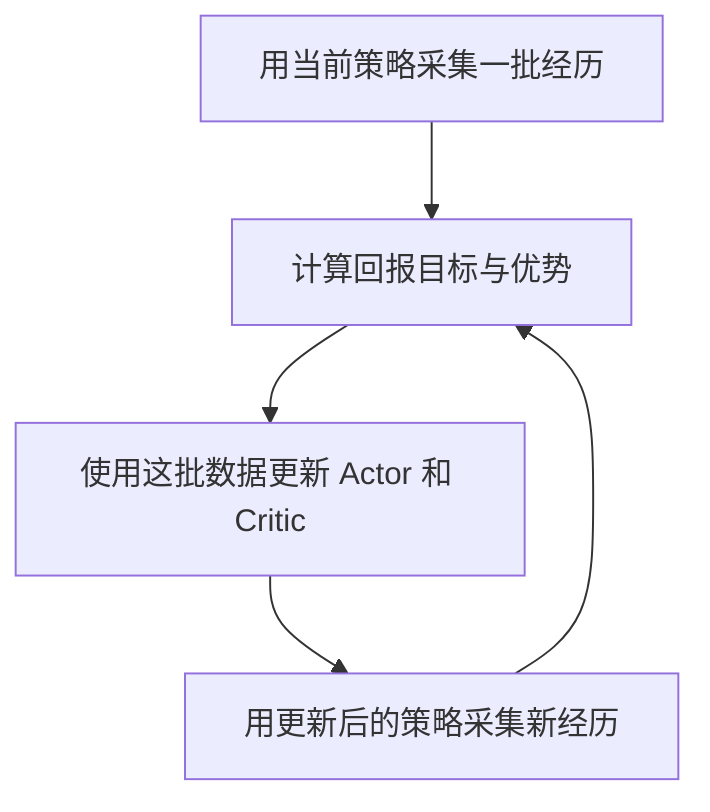

# 第一课 · 第八小节：把一次更新放回 PPO 训练循环

记录日期：2026-10-01。阶段：L01-S08。状态：教学内容与阶段回顾已整理，学员理解待确认；未运行新的训练实验。

## 目标与范围

用户在研究简报后要求继续学习。承接第七小节的真实代码演示，先回顾“损失 → 梯度 → 参数更新”，再只增加采集经历与同批训练两个环节，不同时展开 GAE、并行环境或连续动作分布。

本轮只维护教学与恢复记录。既有 Actor/Critic 数值来自第七小节的 CPU 固定样本演示，不是本轮新增测量，也不是机器人训练结果。

## 阶段回顾：同一条经历有两种用途

沿用完整回合、不打折的教学例子：初始观测描述关节角、速度和机身姿态；Actor 在这个观测下采样动作 0，采集时概率 50%；Critic 预测从这里继续行动的回报为 10。随后获得奖励 4、5、5，初始时刻的实际累计回报为 14，简化优势为 +4。14 是初始时刻的回报，不能给这段经历中所有时刻都贴上同一个回报标签。

- Actor：用 +4 这个评分训练动作分布；第七小节的简化网络在一次 SGD 更新后，动作 0 概率由 50% 变成约 59.87%。这是同一输入下的概率变化，不是关节角度增加。
- Critic：用回报目标 14 训练预测；基础平方损失对示例唯一权重的梯度为 −8，一次更新后预测从 10 变成 10.8。长期学习的是当前策略的平均回报，不能永远固定为 14。
- `backward()` 计算并保存梯度；`optimizer.step()` 才修改网络参数。两个网络的训练目标不同，都服务于改善策略表现。

数字与执行证据见[第七小节](README_LESSON01_ACTOR_CRITIC_UPDATE_20260930.md)，本轮没有重跑已有验证。

## 本节新内容：采集与更新分开看

以下讲常见的同步 PPO 流程，不声称所有机器人系统都采用相同执行调度。



### 采集阶段

策略根据观测给出动作分布，采样动作，让仿真环境执行，保存经历。在这一段采集中，策略参数通常保持固定。机器人一直在动、观测和动作一直变化，不等于每个控制步都在更新网络参数。

除观测、动作和奖励，还需保存训练所需的采集信息，例如旧动作概率/对数概率、价值预测和结束标记；字段细节留到后续真实采样代码再讲。

收集一批经历常称为 rollout。一批经历可以来自多个环境、多个回合片段；本节用完整回合简化回报计算，并不要求实际 PPO 等每个回合彻底结束。

### 更新阶段

拿已保存的经历计算损失、反向传播，再执行优化器更新。同一批经历可以分成小批次并训练若干遍；一遍通常称为一个 epoch。本节先理解“同一批数据可以用几遍”，不同时展开小批次划分。

训练五遍数据，不表示仿真器要把当时那段动作重新执行五遍。通常是在对保存的数值做网络计算。更新阶段也不需要每执行一次 `step()` 就立刻让机器人试一个动作。

同批训练时，采集时存下的旧概率保持不变，当前策略对已保存观测/动作的概率会随参数改变。此前已讲过 PPO 裁剪及同批分母，本节只连接其用途，不重复原数值考题。

### 再次采集

有限次数更新后，用更新后的策略重新与环境交互，采集新经历。策略改变后，动作分布、可能遇到的状态及取得的回报都会改变。永远重复第一批数据不能测出新行为的后果，也不能保证旧数据始终适合当前 PPO 更新。

结构示意，不是可直接运行的训练脚本：

```text
重复若干轮：
    用当前策略采集一批经历
    根据这批经历计算回报目标和优势
    对这批数据训练若干遍：
        计算 Actor / Critic 损失
        清除旧梯度，backward()，optimizer.step()
    进入下一轮，用新策略采集
```

本节阶段总结：采集让我们看到行为结果，更新让网络利用这些结果，再采集让我们检验新策略并获得新的学习依据。

## 学习状态与下一道理解检查

- 已讲解：Actor/Critic 更新的整体关系；采集与更新分阶段；同批训练不等于重新执行动作；新策略需要新经历。
- 已答对的历史内容：+4 的概率方向、4.8 裁剪平台、同批旧概率分母。保留这些记录，不重复测试相同题目。
- 本轮用户只表示愿意继续，不能据此认定已理解梯度或训练循环。
- 待回答：假设仿真器采集了 1000 步经历，然后网络用这一批数据训练 5 遍。在这 5 遍更新过程中，仿真器需要把原来 1000 步动作重新执行 5 次吗？
- 预期区分：这 5 遍在处理已保存的经历；后续重新采集才再次产生环境交互。1000 和 5 是教学假设，不是当前训练配置。

先根据答案修正理解，再进入 rollout 内保存哪些字段以及每一步奖励如何形成回报/优势。若梯度仍有卡点，回到第七小节的同一例子，不继续增加新概念。

## 版本、命令与验证

- 主项目：`hp3090:/media/yu/FAFF-E9771/YUANQI`。
- 本地工作区：`/Users/yu/Documents/ChatGPT/元启`。
- 编辑基线与恢复文件哈希：`logs/lesson01_training_loop_base_20261001.json`。编辑前核验服务器工作区、HEAD/GitHub main 和本地已有文档；出现并行变化先停止覆盖。
- 本轮没有新增可执行训练代码，没有执行算法实验、启动仿真或操作真机。文件验证范围为恢复链接、文档差异、暂存范围和 Git 载荷审计。
- 发布日志：`logs/lesson01_training_loop_publish_20261001.log`。最终提交号与远端一致性见日志和 Git 历史，不在提交前声称已推送。

恢复发布状态：

```bash
ssh hp3090
cd /media/yu/FAFF-E9771/YUANQI
git status --short --branch
git log -3 --oneline
git ls-remote origin refs/heads/main
cat logs/lesson01_training_loop_publish_20261001.log
```

## 保存状态、局限与下一步

本节 README、报告索引与当前状态按用户授权同步 GitHub；提交前检查 diff 并运行 `python3 script/project_tools/audit_git_payload.py`，实际结果留发布日志。没有大型模型或网盘传输，也没有需续接的训练作业。

理解问题尚待用户回答。教学结构图和既有单步更新演示不代表学员已独立完成训练，P0 仍未通过。工程主线仍是已有资源基础上的最短 PPO 训练、保存、重载闭环，具体缺口见[当前状态](README_CURRENT_STATE.md)。
