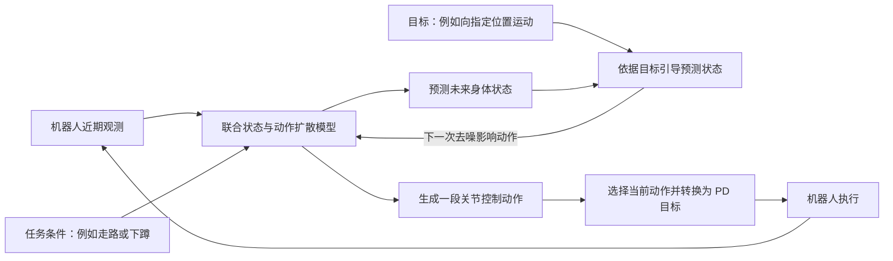

# PredActor 阅读与 Q1 适用性评估

记录日期：2026-10-08（北京时间）。阶段：Q1-PAPER-PREDACTOR-01。状态：原文、公开发行范围与部分代码静态核验完成；未复现。

## 目标与范围

用户指定阅读 **PredActor: Predictive Action Diffusion for Steerable Onboard Humanoid Control**，评估它对衣服/FGP/SMPL 与头环驱动 Q1 全身动作跟随的价值。本次是指定论文阅读，不是新一轮每日资讯检索，也不改变当前训练主线。

结论：**适合作为 Q1 基础跟踪策略完成后的方法参考与对照候选。目前公开包面向 G1 仿真评测，不能据此认为已有可直接移植到 Q1 的完整训练方案。** 最值得学的是：让模型同时生成控制动作和未来身体状态，用未来状态承接任务引导；以及把老师示范、学生犯错后的补充示范、机载运行串成完整工程。

## 来源、时间与证据层级

| 来源 | 核验内容与时间 | 边界 |
| --- | --- | --- |
| [arXiv 摘要与版本历史](https://arxiv.org/abs/2609.24840) | v1：2026-09-21 16:20:25 UTC；v2：09-26 15:34:24 UTC；v3：10-05 08:34:26 UTC | 10/8 首次在本项目专题阅读，不称为“今天新发表” |
| [v3 正文](https://arxiv.org/html/2609.24840v3) | 已读方法、训练、实验、相关工作，以及附录 B/C/D 中的输入、部署、评测协议与局限 | HTML 全文阅读；没有运行论文实验或独立验证作者结果 |
| [作者项目页](https://masteryip.github.io/predactor.github.io/) | 2026-10-08 UTC 抓取正文及页面配置，核对方法和演示说明 | 未观看视频，页面/README 对户外真机的描述不能替代独立观察 |
| [公开仓库](https://github.com/MasterYip/PredActor) | 固定提交 `147a25f6f9bdefca32449764a5b74783a4473608`；提交时间 2026-10-08 03:24:25 UTC，消息 `doc: update` | 这是核验时的代码身份，不把文档更新当作今日算法发布 |
| 仓库 README、LICENSE、资产清单、部分配置与源码 | GitHub API blobs 已成功获取；代码许可证为 MIT，除另有说明的内容 | 静态核验不是代码运行通过；MIT 不自动涵盖所有外部数据/权重 |
| [作者模型资产入口](https://huggingface.co/MasterYip/PredActor_Artifacts) | 仓库声明发布权重；服务器和 Mac 的小型元数据请求均超时 | 未下载权重，未核验远端文件存在性/完整性或模型卡授权 |

来源 URL、获取时间、字节数、SHA-256、失败情况见[来源清单](../data/manifests/predactor_review_20261008.json)。正文引用以章节/表号为准。论文若干段落把真机结果称为 Table 4，实际计数表为 Table 3；本报告按表格内容识别，避免转述串表。

## 它解决哪一段问题

已有“生成参考动作 → 跟踪策略 → 机器人”的架构，把想做的动作与实际可执行的控制分开。生成器给出的参考可能超出跟踪器能力。仅生成控制动作的扩散策略又缺少一段明确的未来身体轨迹，难以直接表达“下一刻身体应更接近这个位置”的引导。

PredActor 在一个联合模型里输出两类内容：

- **未来状态**：机器人各身体部位的位置/速度、根部状态等，用于在模型内部判断和调整运动方向。
- **未来动作**：发给关节控制器的命令。部署时选择其中的动作，转换成 PD 目标执行；没有额外的神经网络参考跟踪器。底层关节控制仍然存在。



通俗理解：它一边拟定接下来怎样控制关节，一边预测机器人身体会怎样运动；如果预测轨迹偏离任务目标，就在生成过程中调整。这并不保证任何目标都物理可行，强引导仍可能把输出推离训练分布。

这里的“未来状态”**不是 PPO Critic 预测的累计回报**。它预测的是具体身体运动。推理时的引导修改候选轨迹，不等于每个控制周期都重新训练网络权重。

原文区分两种引导：CFG 加强已经学过的任务条件，例如更明确地执行“下蹲”；CG 对预测状态施加可微目标，例如朝目的地运动。正文 Figure 3 / Appendix B.4 说明：状态引导不立即重算同一步动作，而是在下一次去噪中经状态到动作的注意力影响动作。不能把它说成额外运行一个 PPO Critic 评分后更新 Actor。

## 训练数据从哪里来，与 PPO 有何不同

```text
人体/生成动作库及任务标签
    → 已具备动作跟踪能力的老师在仿真中执行
    → 记录观测历史、身体轨迹、老师动作、任务标签
    → 给状态/动作片段加噪，训练 PredActor 恢复目标片段
    → 固定学生去仿真尝试，收集学生实际到达的状态
    → 从这些状态另开仿真分支，让老师给出后续示范
    → 把补充示范加入数据集，继续监督训练
```

最后三步属于 DAgger 式数据聚合：学生犯错后可能遇到原示范没覆盖的状态，再请老师为这些状态提供示范。老师分支不应偷偷改动学生正在运行的仿真或随机数状态。正文 B.2 明确它是扩充监督数据，不是通过 reward 做 PPO 微调。

| 对照项 | 我们前面学习的 PPO | PredActor 本文学生训练 |
| --- | --- | --- |
| 主要学习依据 | 环境奖励及优势估计 | 老师提供的动作和未来状态轨迹 |
| 主要更新内容 | Actor 参数，以及用于估计价值的 Critic 参数 | 联合扩散网络参数，减少动作、动作差分、未来状态的重建误差 |
| 数据怎样补充 | 新策略重新与环境交互 | 先收老师示范，再为学生访问过的状态补老师示范 |
| 是否需要可用老师 | 通常不要求动作老师 | 本文训练路线依赖跟踪老师 |

仓库 README 致谢 TextOp 提供 RL tracker 框架和预训练跟踪器。论文比较实验使用 152 段 G1 重定向 ACCAD 动作、每段 50 次老师 rollout，共 7,600 个 episode；六个学习策略分别使用三个训练种子、50 epoch。该数字是其比较协议，不代表从零得到 Q1 老师及完整训练体系的总成本，也不能据此给出我们 3090 的训练时长。

因此，“部署时取消独立 tracker”不意味着“训练时不需要 tracker”。我们先建立 Q1 动作跟踪基线，后续可能同时获得直接可用的控制器与学生模型的数据老师。

## 实验结果怎样读

以下数字全部来自作者报告，未独立复现。

| 结果 | 支持的结论 | 不能推出的结论 |
| --- | --- | --- |
| 目的地任务 44/45 到达 | 指定测试中能引导根部接近目标 | 到达定义是首次进入 0.6 m 范围，不代表手腕厘米级精度、持续驻留或逐帧 SMPL 跟踪 |
| 文本检索 0.539，对照 DiffuseLoco + TextCFG 为 0.424 | 执行动作与文本的匹配指标有提升 | 两者有效窗口分别为 119/135、126/135；生存率和筛选条件也要一起看，不能等同于理解任意自然语言 |
| 扰动 survival 为 0.511 ± 0.030，对照为 0.563 ± 0.009 | 有受扰运行能力，但并非所有指标最好 | Appendix C.1 定义为存活时间占 650 步的比例，不能写成“51.1% 的推搡试验成功” |
| Orin NX 完整 callback 中位数 16.790 ms，P95 19.383 ms | 特定机载设置下，大部分调用满足 20 ms 预算 | 测试使用接收到的状态、零执行指令；593/600 达标，7 次超时，未证明硬实时或真实传感器到电机端到端时延 |
| 六种真机设置，各 5 次试验，计数为 5/5 或 4/5 | G1 有具体部署与重复动作/受扰试验证据 | 小样本不等于跨机器人、长时间或任意动作可靠性 |

正文表 2 的约 1.321 ms 是 RTX 4090、batch 5 下按动作摊销的 actor 时间，不能拿它充当 Orin 的完整单次控制延迟。

ARDY + SONIC 是一个组合系统参考，不是对 SONIC 所有能力的总评。其原始参考仅 2/15 目的地任务、23/45 文本任务通过转换器的关节范围检查，而且只用一个模型；其他学习策略用三个训练种子。应阅读覆盖率和接口差异，不能据此认定“SONIC 已被全面超过”。

## 开源状态与静态代码发现

核验提交：[147a25f](https://github.com/MasterYip/PredActor/tree/147a25f6f9bdefca32449764a5b74783a4473608)。

- 根 README 与 `PredActor/README.md` 明确：目前是 **evaluation-only** 发行包。浏览器 MuJoCo 评测、G1 资产已提供；数据采集/标注、完整 BC 训练、DAgger、机器人部署仍列在待发布清单。
- 目录里确实能看到一些训练类、配置和 `bc_training_step.py`，静态阅读可见 `compute_loss → backward → optimizer step`。这些片段不能代替作者尚未正式提供的完整训练入口、数据、老师和复现资产。
- `scripts/hf_manifest.yaml` 声明 PDP051 `latest.ckpt` 为 49,212,894 字节，SHA-256 `2d963b32786f2989c6472726df9fcfe6b385590127e12e1f549a4b7d77488b2e`；G1 MotionCLIP 权重为 542,749,069 字节，SHA-256 `66a127df4958b346089b2020f2705c7456d9db0ee8b4bd9518608b708b35fc3c`。这些是**作者清单值**，不是本次下载校验结果；数据集目录标为未来预留。
- `moref_teleop.py` 是可设置数值、用 GUI 注入三维条件的 provider。文件名含 teleop 不能证明已有 SMPL 动捕接入。
- `wrist_guide.py` 已提供左右腕部引导、身体权重与激活强度，按 G1 身体索引写入未来位置增量。它不是现成的头环标定、六维腕姿/手指控制和实时 SMPL 协议。代码说明中提及躯干相对目标，但所读 `build_deltas` 实际主要构造随未来步数递增的位置增量；移植时应核实数值语义，不能只凭注释接线。
- 本次没有安装环境、执行下载的代码、下载 checkpoint、启动仿真训练或操作真机。

论文 reproducibility statement 的“提供开源代码与复现材料”应结合当前仓库发行清单解读，不能把方法描述完整误认为训练与部署资产全部可用。

## 映射到 Q1 的具体代价

当前 Q1 的证据入口为[Q1 分支的重定向阶段](https://github.com/z2964141870-debug/agibot-X2-A3-Q1-model/blob/Q1/reports/README_Q1_RETARGET_20261008.md)：22 关节模型、离线几何重定向和支撑回放已验证；测试使用合成同机器人 FK→IK 数据。真实人体 SMPL、无支撑动态跟随、行走 policy 与真机仍待验证。

10/10 同步说明：上段是 10/8 专题阅读时的状态。报告在 Q1 专用分支，链接已更正；不能用它代替 Q1 当前阶段记录。

| 项目需求 | PredActor 提供的参考 | 我们仍需完成 |
| --- | --- | --- |
| SMPL 驱动身体、腿部和移动 | 将目标转成内部未来状态引导的思路 | 人体到 Q1 的可行参考、实时条件表示、逐帧误差与脚接触评测；文字动作选择不等价于这个目标 |
| 头环精确控制手/腕 | 公开代码已有腕部位置引导入口 | 标定、坐标变换、姿态/手指信息、遮挡可靠性、跨设备时间戳；仅换输入设备不足以主张创新 |
| Q1 策略训练 | 老师 rollout → 扩散学生 → DAgger 数据闭环 | 可用的 Q1 老师、重采集示范及完整训练工程；G1 权重不能直接换 22 维输出使用 |
| 板载控制 | 滚动去噪、复用中间结果、延迟选动作、C++ 路径 | Q1 算力与运行时、PD 参数、动作顺序/尺度、硬件通信及整环延迟重新验证 |
| 机器人状态输入 | 29 DOF G1 的 96 维观测 | Q1 的关节、重力方向、角速度、前一动作和基座线速度是否可获得/可靠；IMU 并不直接提供无漂移线速度 |

附录 B 的 G1 物理状态为 192 维，映射为 384 维内部表示；动作 29 维，语义条件 512 维，预测窗口 20 步。这些均与机器人身体定义和训练分布绑定。跨 X2/A3/Q1 的共同表示、动力学差异和数据迁移不是本文已经解决的问题。

“只用本体观测”主要说机器人状态输入，不代表任务目标不需要外部来源；头环 SLAM 仍可作为操作者参考/坐标变换来源。不要把操作者头部 SLAM 位姿直接当成机器人基座状态。

## 可借鉴的研究问题：沿用 H001，不新增已确立创新

来源方法 → 具体瓶颈：PredActor 可在未来状态上施加引导；我们的身体与手腕观测来自不同设备，迟到或遮挡后的错误腕部参考可能把全身控制拉向错误目标。

待验证问题：**衣服与头环数据可靠性变化时，怎样调节腕部引导，使跟随精度与全身稳定性同时受益？** 这只是既有 [H001](research/README_IDEAS.md) 的候选实验切口，不是新颖性结论。

需要改造的部分：明确采样时刻、坐标系和有效性；把参考年龄/可靠性映射到每个身体目标的引导强度；观测恢复时防止突跳；保证输入严格因果。PredActor 的简单身体权重/激活强度与已有 EgoLocate 的 GRU、新鲜度门控、FGP fallback 都必须作为先行实现。

最小实验与前置条件：

1. 先完成 Q1 无支撑的低幅动作跟踪基线，核实同步数据和独立手腕参考；在冻结的共同控制器上开展实验。若选用 PredActor 作为骨干，还需补齐 Q1 老师、学生训练与公开发行缺口，当前不能直接开做。
2. 同一批“站立伸手/小幅转身”记录，注入 0/50/100/200 ms 延迟与短时丢失，再用真实延迟记录检验。上述时间是实验设定，不是本项目已测延迟。按录制会话/被试划分，不能把同一片段相邻帧放到训练和测试两边。
3. 朴素基线：固定引导强度；简单时间补偿与超时停用/渐弱；已有 EgoLocate 门控在资产可用时加入。候选方法再考虑同时利用时间与可靠性，保持输入、模型规模、下游控制器和运行预算一致。
4. 消融：去掉观测年龄、去掉可靠性、去掉恢复时的渐变规则，其他保持一致。主要比较手腕位置/姿态误差、身体/脚部跟踪、跌倒/接触失稳、恢复突跳，以及 P95/超时次数；不能只看平滑或总奖励。
5. 失败判据：不优于简单时间补偿/固定门控，或仅合成延迟有效，或误差下降以明显增大延迟/失稳为代价，则放弃复杂方法。正式量化阈值需在取得基线分布后、正式比较前确定，当前不编造改善百分比。

查新边界：本次读到原文对 Diffuser、Diffuse-CLoC、SCDP、Streaming Diffusion Policy、DAgger 等已有工作的区分，没有独立复核这些论文全部细节。项目既有 GAE 阅读已确认延迟条件预测的直接先例。后续须检索 `uncertainty/confidence-weighted guidance`、`masked/partial-body control`、`delay-aware humanoid teleoperation`、`adaptive guidance`、`out-of-sequence measurement` 与控制中的延迟补偿/鲁棒跟踪。本文 D.3 也明确把 constrained/adaptive guidance 列为后续方向。**仅“引入扩散”“加预测”“按可靠性调权重”“接头环”都不足以宣称原创。** 本次未完成该问题系统查新。

## 关键决定与下一步

现在学习它的“训练时要有老师”和“预测状态可被目标引导”这两个要点；工程仍先推进实际 SMPL 数据合同、Q1 无支撑跟踪基线。基线完成后，再评估是否需要扩散学生，或只借用可验证的局部机制。

若以后专门安排复现，第一关应是固定公开提交与 PDP051，在服务器做 G1 仿真评测和输入/引导检查；成功只算原平台推理复现，不能记成 Q1 训练成功。完整训练/部署发行更新属于可跟踪的实质变化。没有因论文启动新实验。

## 版本、命令与产物

- 主工作副本：hp3090 的 `/media/yu/FAFF-E977/YuanQi_Q1`，开始与写入前均为干净 `Q1`，HEAD `4e954bf411e23f6eb596b025ac1ca002ceefd24f`。
- 论文、网页与代码原始节选：服务器 `data/research/predactor_20261008/`，均被 Git 忽略；未在 Mac 新增大型文件。
- 获取日志：服务器 `logs/predactor_source_fetch_20261008.log`；本次获取状态汇总与发布记录见 `logs/predactor_review_20261008/`。
- 小型清单：`data/manifests/predactor_review_20261008.json`；单论文去重记录分别增补到服务器和 Mac 的 `research_watch_state.json`，不覆盖各自已有每日记录。
- Mac 阅读副本：`/Users/yu/Documents/ChatGPT/元启/reports/README_PREDACTOR_20261008.md`。
- 网络失败：服务器访问 raw.githubusercontent.com 超时后改用同一提交的 GitHub API blob 成功；Hugging Face 在两台主机均未成功，不把权重声明写成已校验资产。

只读复核命令（不安装、运行第三方代码）：

```bash
ssh hp3090
cd /media/yu/FAFF-E977/YuanQi_Q1
git branch --show-current
git status --short --branch
git log -3 --oneline
cat reports/README_PREDACTOR_20261008.md
cat data/manifests/predactor_review_20261008.json
```

## 保存与同步状态

研究内容提交 `38a7805086203f54f7b9a1b12653d3ecc6d89285` 已推送到用户指定仓库 `Q1` 分支；2026-10-08T10:31:08.127880+00:00 核验本地 HEAD 与 `refs/heads/Q1` 一致，工作区干净。七个阶段文件的 Git payload 审计通过。发布过程记录在服务器与 Mac 的 `logs/predactor_review_20261008/content_publish.json`；来源清单也登记本次内容提交的核验信息。本段及清单的同步回执随后单独保存，不通过把提交号写入自身来反复提交。

原始网页/代码节选仅存服务器；没有产生模型或数据集，不涉及新的大模型网盘备份。Hugging Face 权重未下载。已有训练产物的网盘状态未在本次改变。

本次只登记这篇论文及 H001 相关切口。Mac 上 10/6–8 每日研究记录原有待同步事项独立保留，不用旧通用项目文件覆盖 Q1 最新进度，也不顺带提交它们。


### 同步回执的后续恢复检查点

研究正文七文件的内容提交 `38a7805086203f54f7b9a1b12653d3ecc6d89285` 已推送并核验；这一事实不受后续连接中断影响。随后仅修改本 README 的同步说明和来源清单的 publication 字段，两文件暂存审计通过。补存回执时 SSH 再次中断，重试与最终只读探测也未取得确认，故**回执后续提交/推送状态为 UNKNOWN_AFTER_SSH_TIMEOUT**。本小节只在 Mac 保存，不能假称已同步。

恢复时先查看服务器 `git status --short --branch`、`git log -3 --oneline`、`logs/predactor_review_20261008/final_publish.json`，再核对 `git ls-remote origin refs/heads/Q1`。据实际 HEAD/暂存状态决定是否需要继续提交或只需推送；不要盲目重复操作或覆盖并行工作。Mac 的 `logs/predactor_review_20261008/publication_receipt_changes.json` 保存两文件的预期版本，`publication_followup_status.json` 保存故障摘要。原始研究结论、索引、去重与候选记录均包含在已经确认发布的内容提交内。
